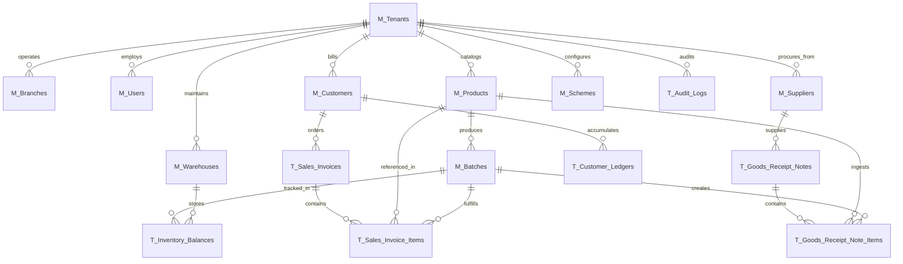

# Backend Database Schema Specification & Data Dictionary
## PharmaGrid™ Cloud Distribution ERP (PostgreSQL 16)

| Attribute | Specification Details |
| :--- | :--- |
| **Document Version** | `1.0.0` (Production Database Baseline) |
| **Target Database Engine** | PostgreSQL 16+ (Compatible with AWS RDS Aurora & Azure Database for PostgreSQL) |
| **Multi-Tenancy Model** | Shared Database, Shared Schema with Row-Level Tenant Isolation (`TenantId` UUID) |
| **ORM Framework** | Entity Framework Core 9.0 (C# / .NET 9) with Global Query Filters |
| **Statutory Compliance** | Drugs & Cosmetics Act 1940 (Schedules H, H1, X, G), CDSCO 5-Year Record Retention, Indian GST Rule 46 |
| **Related SQL DDL Script** | [`03_DATABASE_SCHEMA_POSTGRESQL.sql`](file:///d:/Training/working/Cognivectra/cybe-pharma/docs/03_DATABASE_SCHEMA_POSTGRESQL.sql) |

---

## 1. High-Level Entity Relationship Diagram (ERD)



---

## 2. Multi-Tenancy Architecture & Logical Data Isolation

### 2.1 The Multi-Tenant Guarantee
PharmaGrid enforces a shared-database, shared-schema tenancy architecture. Every table holding organizational, master, or transactional data implements the `ITenantEntity` interface, requiring an immutable `TenantId UUID NOT NULL` column.

### 2.2 Entity Framework Core Query Interception
All queries executed through the .NET 9 Clean Architecture backend are intercepted at compile-time by an EF Core Global Query Filter:
```csharp
// PharmaGrid.Infrastructure.Persistence.ApplicationDbContext
protected override void OnModelCreating(ModelBuilder modelBuilder)
{
    foreach (var entityType in modelBuilder.Model.GetEntityTypes())
    {
        if (typeof(ITenantEntity).IsAssignableFrom(entityType.ClrType))
        {
            var parameter = Expression.Parameter(entityType.ClrType, "e");
            var property = Expression.Property(parameter, nameof(ITenantEntity.TenantId));
            var tenantProperty = Expression.Property(
                Expression.Constant(_tenantService),
                nameof(ICurrentTenantService.TenantId));

            var filter = Expression.Lambda(
                Expression.Equal(property, tenantProperty),
                parameter);

            modelBuilder.Entity(entityType.ClrType).HasQueryFilter(filter);
        }
    }
}
```
- **Automatic Scoping**: SQL queries generated by EF Core automatically append `WHERE e.TenantId = @__tenantId` without requiring developer intervention.
- **Save Interception**: `SaveChangesAsync()` automatically populates `TenantId` from the active JWT context for newly inserted entities.

---

## 3. Data Dictionary: Comprehensive Table Specifications

### 3.1 Organization & Master Hierarchy

#### Table: `M_Tenants`
Stores wholesale distributor organizations licensed to operate PharmaGrid.
| Column | Type | Nullable | Default | Description & Statutory Relevance |
| :--- | :--- | :--- | :--- | :--- |
| `TenantId` | UUID | NO | `gen_random_uuid()` | Primary Key. Global identifier for the stockist entity. |
| `TenantName` | VARCHAR(200) | NO | - | Display name of the wholesale company. |
| `LegalBusinessName` | VARCHAR(255) | NO | - | Legal entity name as per GST and Drug Department records. |
| `Subdomain` | VARCHAR(50) | NO | - | Unique tenant routing subdomain (e.g., `chennai-pharma`). |
| `PanNumber` | VARCHAR(10) | NO | - | 10-character Indian Permanent Account Number. |
| `GstinNumber` | VARCHAR(15) | NO | - | 15-character statutory Indian GSTIN format. |
| `StateCode` | VARCHAR(2) | NO | - | 2-digit Indian State GST Code (e.g. `33` for Tamil Nadu). |
| `DrugLicense20B` | VARCHAR(50) | NO | - | Wholesale Drug License 20B (allopathic non-schedule C/C1). |
| `DrugLicense21B` | VARCHAR(50) | NO | - | Wholesale Drug License 21B (schedule C & C1 formulations). |
| `ContactEmail` | VARCHAR(150) | NO | - | Official contact and billing notification email. |
| `ContactPhone` | VARCHAR(20) | NO | - | Primary office telephone or verified mobile number. |
| `IsActive` | BOOLEAN | NO | `TRUE` | Tenant operational status flag. |
| `CreatedAt` | TIMESTAMPTZ | NO | `CURRENT_TIMESTAMP` | System creation timestamp. |
| `UpdatedAt` | TIMESTAMPTZ | NO | `CURRENT_TIMESTAMP` | Last modification timestamp. |

#### Table: `M_Branches`
Physical warehouse depots or sales branches operating under a parent tenant.
| Column | Type | Nullable | Default | Description |
| :--- | :--- | :--- | :--- | :--- |
| `BranchId` | UUID | NO | `gen_random_uuid()` | Primary Key. |
| `TenantId` | UUID | NO | - | FK to `M_Tenants(TenantId)`. |
| `BranchCode` | VARCHAR(20) | NO | - | Code (e.g., `DEPOT-TN01`). |
| `BranchName` | VARCHAR(150) | NO | - | Branch location label (e.g. `Main Chennai Depot`). |
| `AddressLine1` | VARCHAR(255) | NO | - | Street address. |
| `City` | VARCHAR(100) | NO | - | Municipal corporation / city. |
| `StateCode` | VARCHAR(2) | NO | - | Branch operating state code for GST Place of Supply calculation. |
| `Pincode` | VARCHAR(10) | NO | - | Indian postal code. |
| `GstinNumber` | VARCHAR(15) | NO | - | Branch GSTIN (can differ across states). |
| `DrugLicenseNo` | VARCHAR(50) | NO | - | Branch-specific CDSCO Drug License. |
| `IsHeadOffice` | BOOLEAN | NO | `FALSE` | Flag identifying parent billing headquarters. |

---

### 3.2 Product Catalog & Batch Master

#### Table: `M_Products`
Statutory pharmaceutical SKU directory with pricing, schedules, and cold chain rules.
| Column | Type | Nullable | Default | Description |
| :--- | :--- | :--- | :--- | :--- |
| `ProductId` | UUID | NO | `gen_random_uuid()` | Primary Key. |
| `TenantId` | UUID | NO | - | Multi-tenant scoping FK. |
| `ProductCode` | VARCHAR(50) | NO | - | Internal SKU barcode / lookup code. |
| `ProductName` | VARCHAR(255) | NO | - | Trade / Brand name (e.g., `Pan 40mg Injection`). |
| `GenericName` | VARCHAR(255) | NO | - | Active Pharmaceutical Ingredient (API / Molecule). |
| `ManufacturerName` | VARCHAR(150) | NO | - | Pharmaceutical manufacturer (e.g., `Alkem Labs`). |
| `DosageForm` | VARCHAR(50) | NO | - | Formulation type (`Tablet`, `Injection`, `Syrup`, `Vial`). |
| `Strength` | VARCHAR(50) | YES | - | Molecule potency (e.g., `40mg`, `625mg`, `100IU/ml`). |
| `PackSize` | VARCHAR(50) | NO | - | Packaging unit specification (e.g., `10x10 Tablets`, `1 Vial`). |
| `UOM` | VARCHAR(20) | NO | - | Unit of Measure (`Strips`, `Bottles`, `Vials`, `Boxes`). |
| `HSNCode` | VARCHAR(10) | NO | `'30049099'` | Indian Harmonized System of Nomenclature code for pharma. |
| `GSTPercentage` | NUMERIC(5,2) | NO | `12.00` | Statutory GST rate (`0.00`, `5.00`, `12.00`, `18.00`). |
| `MRP` | NUMERIC(14,2) | NO | - | Maximum Retail Price inclusive of all taxes. |
| `PTR` | NUMERIC(14,2) | NO | - | Price To Retailer (pre-tax wholesale rate). |
| `PTS` | NUMERIC(14,2) | NO | - | Price To Stockist (distributor landing baseline). |
| `PurchaseRate` | NUMERIC(14,2) | NO | - | Actual net purchase rate after manufacturer discounts. |
| `ScheduleClass` | `schedule_class_enum` | NO | `'Regular'` | CDSCO Classification: `'Regular'`, `'G'`, `'H'`, `'H1'`, `'X'`. |
| `StorageCondition` | `storage_condition_enum`| NO | `'Room Temperature'` | Storage requirement: `'Room Temperature'`, `'Cold Chain (2-8°C)'`, `'Deep Freeze (-20°C)'`. |
| `ReorderLevel` | INT | NO | `50` | Automated purchase indent trigger threshold. |
| `IsActive` | BOOLEAN | NO | `TRUE` | Soft status flag. |

#### Table: `M_Batches`
Physical manufacturing batch instances tied to explicit expiry dates and rack bins.
| Column | Type | Nullable | Default | Constraints & Business Logic |
| :--- | :--- | :--- | :--- | :--- |
| `BatchId` | UUID | NO | `gen_random_uuid()` | Primary Key. |
| `TenantId` | UUID | NO | - | Tenant FK. |
| `ProductId` | UUID | NO | - | FK to `M_Products(ProductId)`. |
| `BatchNumber` | VARCHAR(50) | NO | - | Manufacturer batch code stamped on packaging. |
| `ManufacturingDate`| DATE | NO | - | Date of manufacturing. |
| `ExpiryDate` | DATE | NO | - | Statutory expiry date. **Constraint**: `ExpiryDate > ManufacturingDate`. |
| `PurchaseRate` | NUMERIC(14,2) | NO | - | Cost rate for this specific batch. |
| `MRP` | NUMERIC(14,2) | NO | - | Maximum retail price on this batch carton. |
| `PTR` | NUMERIC(14,2) | NO | - | Wholesale price to retailer. |
| `WarehouseId` | UUID | NO | - | Warehouse FK where batch resides. |
| `LocationRackBin` | VARCHAR(50) | NO | - | Physical warehouse bin: `Zone-Rack-Shelf-Bin` (e.g. `Z1-R02-S03-B01`). |
| `AvailableQuantity`| INT | NO | `0` | Live unreserved physical units. **Constraint**: `AvailableQuantity >= 0`. |
| `IsQuarantined` | BOOLEAN | NO | `FALSE` | CDSCO regulatory freeze flag (stops FEFO allocation). |

---

### 3.3 Physical Inventory & Balances

#### Table: `T_Inventory_Balances`
Real-time state machine tracking stock availability across quarantine, damage, and booking stages.
| Column | Type | Nullable | Default | Description |
| :--- | :--- | :--- | :--- | :--- |
| `BalanceId` | UUID | NO | `gen_random_uuid()` | Primary Key. |
| `TenantId` | UUID | NO | - | Tenant FK. |
| `ProductId` | UUID | NO | - | Product FK. |
| `BatchId` | UUID | NO | - | Batch FK. |
| `WarehouseId` | UUID | NO | - | Warehouse FK. |
| `QuantityAvailable` | INT | NO | `0` | Stock eligible for immediate counter billing. |
| `QuantityReserved` | INT | NO | `0` | Stock locked in open draft sales orders or picking slips. |
| `QuantityDamaged` | INT | NO | `0` | Breakage / ampoule leakage awaiting write-off. |
| `QuantityExpired` | INT | NO | `0` | Expired stock waiting for manufacturer credit note return. |
| `QuantityQuarantined`| INT | NO | `0` | Statutory hold per CDSCO inspector or temp excursion. |

---

### 3.4 Stakeholders: CRM & Vendor Masters

#### Table: `M_Customers`
B2B Chemist, Hospital, and Pharmacy CRM with regulatory Drug License verification.
| Column | Type | Nullable | Default | Statutory Relevance |
| :--- | :--- | :--- | :--- | :--- |
| `CustomerId` | UUID | NO | `gen_random_uuid()` | Primary Key. |
| `TenantId` | UUID | NO | - | Tenant FK. |
| `CustomerCode` | VARCHAR(50) | NO | - | Unique chemist customer code. |
| `CustomerName` | VARCHAR(255) | NO | - | Pharmacy / Hospital legal name. |
| `CustomerType` | VARCHAR(50) | NO | `'Retail Pharmacy'`| Category: `Retail Pharmacy`, `Hospital`, `Dispensing Clinic`. |
| `GstinNumber` | VARCHAR(15) | NO | - | Chemist GSTIN for B2B tax invoice credit. |
| `StateCode` | VARCHAR(2) | NO | `'33'` | 2-digit Indian State code for Dual GST resolution. |
| `DrugLicense20B` | VARCHAR(50) | NO | - | Mandatory Form 20B license number. |
| `DrugLicense21B` | VARCHAR(50) | NO | - | Mandatory Form 21B license number. |
| `LicenseExpiryDate`| DATE | NO | - | Expiry date of Drug License. Hard-stop if expired. |
| `CreditLimit` | NUMERIC(14,2) | NO | `50000.00` | Authorized unsecured credit ceiling. |
| `CurrentOutstandingBalance`| NUMERIC(14,2)| NO | `0.00` | Real-time unpaid ledger balance. |
| `CreditPeriodDays`| INT | NO | `21` | Standard payment credit cycle (15, 21, 30 days). |
| `IsBlockedForBilling`| BOOLEAN | NO | `FALSE` | Manual or automated credit block flag. |

---

### 3.5 High-Velocity Sales & Invoicing

#### Table: `T_Sales_Invoices`
Atomic header for finalized commercial sales bills fulfilling Indian GST Rule 46.
| Column | Type | Nullable | Default | Description |
| :--- | :--- | :--- | :--- | :--- |
| `InvoiceId` | UUID | NO | `gen_random_uuid()` | Primary Key. |
| `TenantId` | UUID | NO | - | Tenant FK. |
| `BranchId` | UUID | NO | - | Dispatching branch FK. |
| `CustomerId` | UUID | NO | - | Chemist customer FK. |
| `InvoiceNumber` | VARCHAR(50) | NO | - | Sequential fiscal bill number (e.g., `INV-2026-0891`). |
| `InvoiceDate` | TIMESTAMPTZ | NO | `CURRENT_TIMESTAMP` | Invoice commit timestamp. |
| `InvoiceMode` | `invoice_mode_enum` | NO | `'CREDIT'` | Settlement: `CASH`, `CREDIT`, `UPI`, `CARD`. |
| `PlaceOfSupplyStateCode`| VARCHAR(2) | NO | `'33'` | Determines CGST+SGST vs IGST. |
| `TotalGrossAmount` | NUMERIC(14,2) | NO | - | Sum of (Quantity $\times$ PTR). |
| `TotalTradeDiscountAmount`| NUMERIC(14,2)| NO | `0.00` | Commercial discount total. |
| `TotalSchemeDiscountAmount`| NUMERIC(14,2)| NO | `0.00` | Deal bonus savings total. |
| `TotalTaxableAmount` | NUMERIC(14,2) | NO | - | Base taxable value. |
| `TotalCgstAmount` | NUMERIC(14,2) | NO | `0.00` | Central GST amount. |
| `TotalSgstAmount` | NUMERIC(14,2) | NO | `0.00` | State GST amount. |
| `TotalIgstAmount` | NUMERIC(14,2) | NO | `0.00` | Integrated GST (inter-state). |
| `RoundOffAmount` | NUMERIC(5,2) | NO | `0.00` | Decimal adjustment to nearest integer rupee. |
| `NetPayableAmount` | NUMERIC(14,2) | NO | - | Final payable invoice figure. |
| `Status` | `invoice_status_enum`| NO | `'Finalized'` | `Draft`, `Finalized`, `Dispatched`, `Cancelled`. |
| `PaymentStatus` | `payment_status_enum`| NO | `'Unpaid'` | `Unpaid`, `PartiallyPaid`, `Paid`, `Overdue`. |
| `IrnHash` | VARCHAR(64) | YES | - | 64-character hex Government NIC E-Invoice Hash. |
| `QrCodePayload` | TEXT | YES | - | Signed cryptographic QR code payload from NIC portal. |
| `CreatedByUserId` | VARCHAR(100) | NO | - | User ID / Username of billing operator. |

#### Table: `T_Sales_Invoice_Items`
Itemized line-level fulfillment capturing batch allocation and tax breakdowns.
| Column | Type | Nullable | Default | Description |
| :--- | :--- | :--- | :--- | :--- |
| `ItemId` | UUID | NO | `gen_random_uuid()` | Primary Key. |
| `TenantId` | UUID | NO | - | Tenant FK. |
| `InvoiceId` | UUID | NO | - | FK to `T_Sales_Invoices(InvoiceId)`. |
| `ProductId` | UUID | NO | - | FK to `M_Products(ProductId)`. |
| `BatchId` | UUID | NO | - | FK to `M_Batches(BatchId)`. |
| `BatchNumber` | VARCHAR(50) | NO | - | Denormalized batch code for print speed. |
| `QuantityBilled` | INT | NO | - | Commercial paid units sold. |
| `QuantityFree` | INT | NO | `0` | Scheme bonus units issued (e.g. 1 free on 10). |
| `UnitPricePTR` | NUMERIC(14,2) | NO | - | Price to Retailer charged per unit. |
| `MRP` | NUMERIC(14,2) | NO | - | Maximum Retail Price. |
| `DiscountPercentage`| NUMERIC(5,2) | NO | `0.00` | Line-level trade discount percentage. |
| `DiscountAmount` | NUMERIC(14,2) | NO | `0.00` | Discount monetary deduction. |
| `TaxableAmount` | NUMERIC(14,2) | NO | - | Post-discount taxable line value. |
| `HSNCode` | VARCHAR(10) | NO | `'30049099'` | HSN classification. |
| `GSTPercentage` | NUMERIC(5,2) | NO | `12.00` | Applicable GST rate. |
| `CgstAmount` | NUMERIC(14,2) | NO | `0.00` | CGST calculated. |
| `SgstAmount` | NUMERIC(14,2) | NO | `0.00` | SGST calculated. |
| `IgstAmount` | NUMERIC(14,2) | NO | `0.00` | IGST calculated. |
| `NetLineTotal` | NUMERIC(14,2) | NO | - | Total line value inclusive of tax. |

---

### 3.6 Regulatory Audit & Compliance Logging

#### Table: `T_Audit_Logs`
Statutory 21 CFR Part 11 and CDSCO compliant tamper-evident change register.
| Column | Type | Nullable | Default | Description |
| :--- | :--- | :--- | :--- | :--- |
| `AuditLogId` | BIGSERIAL | NO | Auto | Primary Key (Monotonically increasing 64-bit integer). |
| `TenantId` | UUID | NO | - | Tenant FK. |
| `UserId` | UUID | NO | - | User who performed the operation. |
| `UserIpAddress` | VARCHAR(45) | NO | - | IPv4 or IPv6 client origin. |
| `ClientDeviceUserAgent`| VARCHAR(255)| NO | - | Browser / device client signature. |
| `OperationTimestamp`| TIMESTAMPTZ | NO | `CURRENT_TIMESTAMP` | UTC exact execution timestamp. |
| `ActionType` | VARCHAR(50) | NO | - | Operation: `CREATE`, `UPDATE`, `DELETE`, `CANCEL_BILL`, `QUARANTINE`. |
| `TargetEntity` | VARCHAR(100) | NO | - | Table affected (e.g. `T_Sales_Invoices`, `M_Batches`). |
| `RecordId` | VARCHAR(100) | NO | - | Primary Key string of affected entity. |
| `PayloadBeforeChanges`| JSONB | YES | - | Full JSON snapshot before mutation. |
| `PayloadAfterChanges` | JSONB | YES | - | Full JSON snapshot after mutation. |

---

## 4. PostgreSQL Constraints, Triggers & Immutability Rules

### 4.1 Tamper-Evident Immutability Trigger
Under Indian CDSCO regulations, audit logs and committed commercial tax invoices must never be updated or deleted. PostgreSQL database triggers enforce this at the storage engine layer:
```sql
CREATE OR REPLACE FUNCTION fn_prevent_audit_tampering()
RETURNS TRIGGER AS $$
BEGIN
    RAISE EXCEPTION 'CDSCO Compliance Violation: Modifications or deletions from T_Audit_Logs are strictly prohibited by law.';
END;
$$ LANGUAGE plpgsql;

CREATE TRIGGER trg_protect_audit_logs
BEFORE UPDATE OR DELETE ON T_Audit_Logs
FOR EACH ROW
EXECUTE FUNCTION fn_prevent_audit_tampering();
```

### 4.2 Negative Stock Prevention Check Constraints
To guarantee financial and inventory integrity:
```sql
ALTER TABLE M_Batches 
ADD CONSTRAINT chk_batches_qty_positive 
CHECK (AvailableQuantity >= 0);

ALTER TABLE M_Batches 
ADD CONSTRAINT chk_batches_expiry_validity 
CHECK (ExpiryDate > ManufacturingDate);
```

---

## 5. Performance Indexing Matrix

| Table | Index Name | Type | Indexed Columns | Business Purpose |
| :--- | :--- | :--- | :--- | :--- |
| `M_Products` | `idx_products_tenant_active` | B-Tree | `(TenantId, IsActive, ProductName)` | High-velocity billing search typeahead. |
| `M_Batches` | `idx_batches_fefo_allocation` | B-Tree | `(TenantId, ProductId, IsQuarantined, ExpiryDate, AvailableQuantity)` | **Sub-5ms FEFO engine batch resolution query.** |
| `T_Sales_Invoices` | `idx_invoices_customer_date` | B-Tree | `(TenantId, CustomerId, InvoiceDate DESC)` | Chemist ledger & outstanding invoice lookup. |
| `T_Sales_Invoices` | `idx_invoices_irn_hash` | B-Tree | `(TenantId, IrnHash)` | Government GST E-Invoicing verification lookup. |
| `T_Audit_Logs` | `idx_audit_entity_record` | B-Tree | `(TenantId, TargetEntity, RecordId, OperationTimestamp DESC)` | Regulatory CDSCO audit trail inspection. |
| `T_Audit_Logs` | `idx_audit_payload_jsonb` | GIN | `PayloadAfterChanges jsonb_path_ops` | High-speed deep JSON query on modified fields. |

---

## 6. Migration & Seeding Strategy
1. **Schema Initialization**: Execute [`03_DATABASE_SCHEMA_POSTGRESQL.sql`](file:///d:/Training/working/Cognivectra/cybe-pharma/docs/03_DATABASE_SCHEMA_POSTGRESQL.sql) against a fresh PostgreSQL 16 database.
2. **EF Core Model Sync**: Ensure `ApplicationDbContext` entity mappings match the SQL column data types, precision `(14,2)` for financial fields, and UUID defaults.
3. **Deterministic Seeding**: `DataSeeder.cs` seeds authentic Indian pharmaceutical SKUs, multi-tier expiry batches (0-30d, 31-60d, 61-90d, 91+d), valid and expired customer pharmacies for CDSCO testing, suppliers, and promotional schemes.
