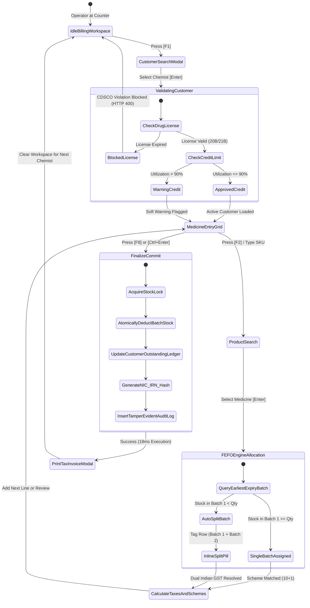
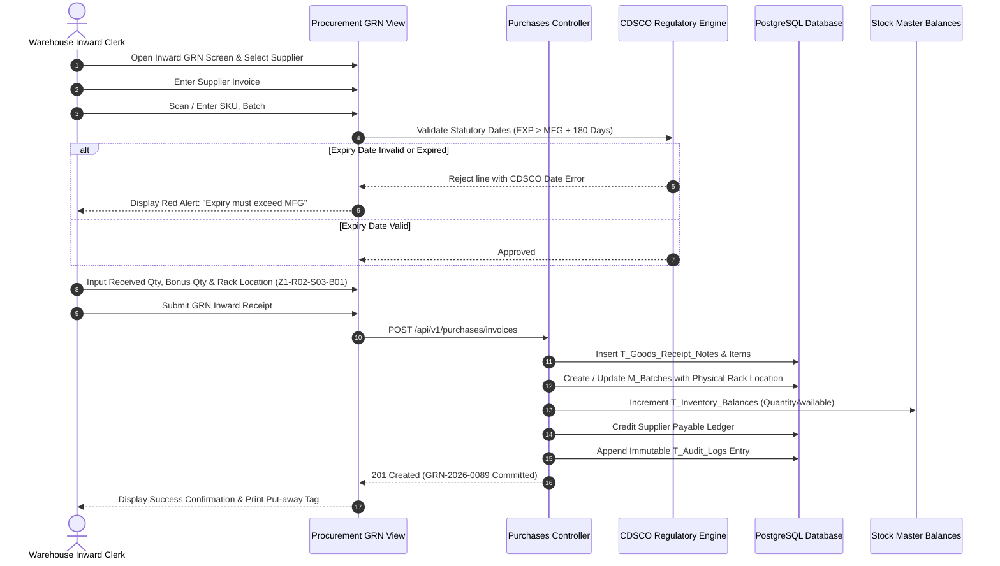
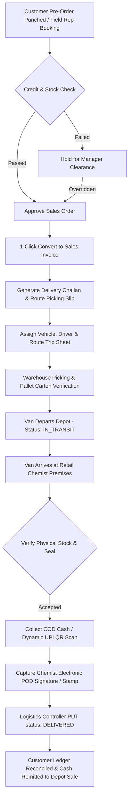
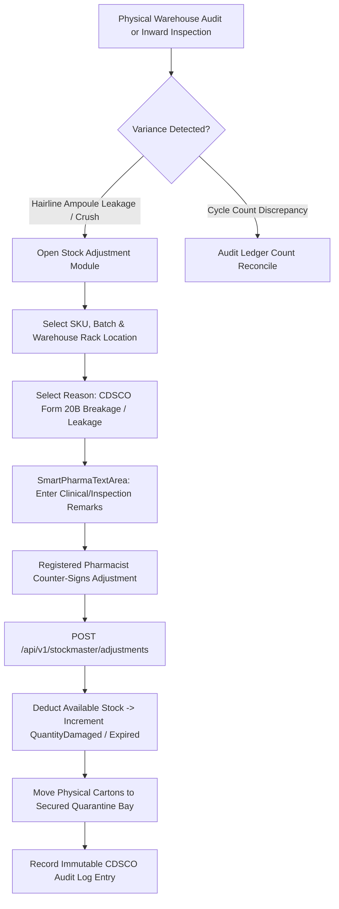
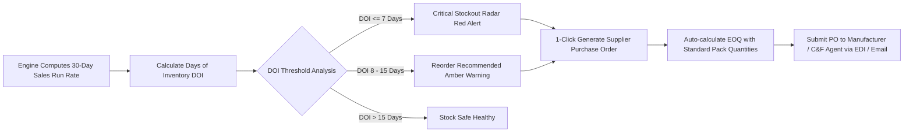

# Application Flow & User Navigation Specification
## PharmaGrid™ Cloud Distribution ERP (Navigation Architecture & Flowcharts)

| Attribute | Specification Details |
| :--- | :--- |
| **Document Version** | `1.0.0` (Production Navigation Architecture) |
| **Navigation Paradigm**| Dual-Mode: 100% Zero-Mouse Keyboard Ergonomics + Modern Responsive Cloud UI |
| **Target Roles** | Billing Cashier, Warehouse Clerk, Dispatch Coordinator, Pharmacist, Purchase Manager, Executive Admin |
| **Global Accelerators**| `F1` - `F8`, `Ctrl + K` (Command Palette), `Ctrl + B` (Sidebar Collapse), `Esc`, `Tab`, `Enter` |

---

## 1. Information Architecture & Hierarchical Site Map

PharmaGrid organizes its enterprise modules into four operational pillars accessible via the persistent Collapsible Sidebar (`Sidebar.tsx`) and the Global Command Palette (`Ctrl + K`):

```
PharmaGrid Enterprise Navigation Tree
├── 01. Executive Command Center
│   ├── Executive Dashboard (`/dashboard`) ── Financial KPIs, 4-Tier Expiry Radar, Live Picking Queue
│   └── Marketing Pitch Showcase (`/landing`) ── Feature Showcase & Enterprise Login Gateway
│
├── 02. High-Velocity Core Operations
│   ├── Rapid Counter Billing (`/billing`) ── Zero-Mouse F1-F8, FEFO Batch Allocator, Dual GST
│   ├── Orders & Field Indenting (`/orders`) ── Customer Pre-Orders & Vendor Purchase Indents
│   ├── Logistics & Dispatch (`/logistics`) ── Route Trip Sheets, Delivery Challans, COD & POD
│   └── Procurement Inward GRN (`/procurement`) ── Vendor Invoices, EXP > MFG Ingestion, Put-away
│
├── 03. Inventory & Regulatory Warehousing
│   ├── Unified Stock Master (`/stockmaster`) ── Physical vs Book vs Quarantine & CDSCO Breakage Write-off
│   ├── Warehouse Bins (`/inventory`) ── Zone-Rack-Shelf-Bin Physical Map & Batch Balances
│   ├── Product Catalog (`/catalog`) ── SKU Directory, Schedules H/H1/X/G, Cold-Chain Rules
│   └── Demand Forecasting (`/forecast`) ── 30-Day Velocity, Days of Inventory (DOI), 1-Click PO
│
└── 04. Stakeholders, Finance & Administration
    ├── Pharmacy Customers CRM (`/customers`) ── Form 20B/21B Validity, Credit Limit Health Meters
    ├── Pharma Scheme Matrix (`/schemes`) ── Volumetric 10+1 Deals, Turnover Rebates, Accrual Claims
    ├── Staff & RBAC Management (`/users`) ── Pharmacist Registration, Terminal Roles, Discount Caps
    ├── Human Capital & Payroll (`/payroll`) ── Monthly Salary Runs, PF/ESI, Statutory A4 Pay Slips
    └── Regulatory Audit Trail (`/auditlogs`) ── Immutable 21 CFR Part 11 Audit Log & Inspector Search
```

---

## 2. 100% Zero-Mouse Keyboard Navigation & Hotkey Matrix

To enable operators to achieve the sub-2-second checkout SLA, PharmaGrid provides comprehensive single-key accelerators. The mouse is never required during standard billing:

| Keystroke | Scope | Immediate Action Performed | Screen Transition |
| :--- | :--- | :--- | :--- |
| **`[F1]`** | Billing Workspace | Focuses Customer Search typeahead modal | Opens Customer Quick-Select dialog |
| **`[F2]`** | Billing Workspace | Inserts new medicine line and focuses SKU lookup | Activates product search dropdown |
| **`[F3]`** | Medicine Grid | Opens FEFO Batch Selector drawer for active SKU | Slides in Batch Comparison Drawer |
| **`[F4]`** | Medicine Grid | Applies or overrides line-level promotional scheme | Focuses Scheme Selector pill |
| **`[F5]`** | Payment Summary | Cycles payment mode (`CASH` $\rightarrow$ `CREDIT` $\rightarrow$ `UPI` $\rightarrow$ `CARD`) | Updates settlement mode tag |
| **`[F6]`** | Medicine Grid | Toggles focus to Quantity input for active line | Selects all text in quantity cell |
| **`[F7]`** | Summary Bar | Previews draft GST tax breakdown and CDSCO text | Opens Rule 46 Tax Invoice preview modal |
| **`[F8]`** or **`[Ctrl+Enter]`** | Billing Workspace | **Commits atomic sales invoice and triggers instant print** | Commits PG transaction ($\le 2$s) & opens print modal |
| **`[Ctrl + K]`** | Global Application | Opens Global Command Palette | Overlays quick-jump navigation menu |
| **`[Ctrl + B]`** | Global Application | Toggles navigation sidebar (collapsed / expanded) | Expands data grid viewport |
| **`[Escape]`** | Modals & Drawers | Closes active modal, clears selection, returns to grid | Dismisses overlay |
| **`[Enter]`** | Form Inputs | Confirms selection and advances cursor to next field | Auto-advances focus |
| **`[Tab]`** | Data Grids | Navigates forward between table columns | Shifts cell focus |
| **`[Shift + Tab]`**| Data Grids | Navigates backward between table columns | Shifts cell focus reverse |
| **`[↑ / ↓ Arrow]`**| Dropdowns / Tables | Navigates through search result list rows | Highlights targeted entity |

---

## 3. End-to-End Operational Workflow State Machines

### 3.1 Workflow 1: Rapid Counter Billing & Instant Checkout



---

### 3.2 Workflow 2: Upstream Procurement & Inward GRN Put-Away



---

### 3.3 Workflow 3: Orders Indenting to Route Dispatch & Electronic POD



---

### 3.4 Workflow 4: Unified Stock Master Audit & CDSCO Breakage Write-Off



---

### 3.5 Workflow 5: 30-Day Demand Forecasting & 1-Click Purchase Reorder



---

## 4. Persona Navigation & Access Pathways

| User Persona | Default Landing Screen | Permitted Sidebar Modules | Primary Keyboard Shortcuts |
| :--- | :--- | :--- | :--- |
| **Billing Cashier** | Rapid Billing (`/billing`) | Billing, Customers, Schemes, Tax Invoice Print | `F1`, `F2`, `F3`, `F5`, `F8`, `Esc` |
| **Warehouse Clerk** | Inward GRN (`/procurement`) | GRN, Warehouse Bins, Stock Adjustments, Catalog | `F2`, `Tab`, `Enter`, `Ctrl+B` |
| **Dispatch Lead** | Logistics (`/logistics`) | Logistics, Challans, Trip Sheets, Sales Orders | `Ctrl+K`, `Enter`, `Tab` |
| **Registered Pharmacist** | Stock Master (`/stockmaster`) | Full Catalog, Audit Logs, Breakage Write-off, Customers | `Ctrl+K`, `F7`, `Esc` |
| **Purchase Manager** | Demand Forecast (`/forecast`) | Demand Forecast, Purchase Orders, Suppliers, Catalog | `Ctrl+K`, `Enter`, `Tab` |
| **Executive Admin / MD** | Executive Dashboard (`/dashboard`)| All 15 Enterprise Modules, User Management, Payroll | Full Keyboard + Command Palette |
